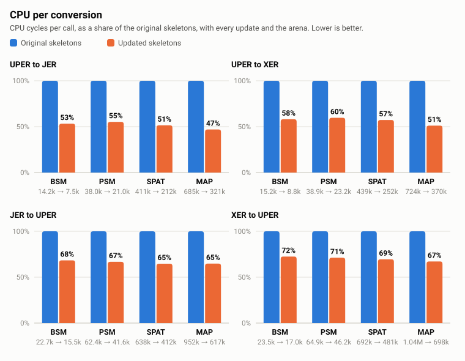
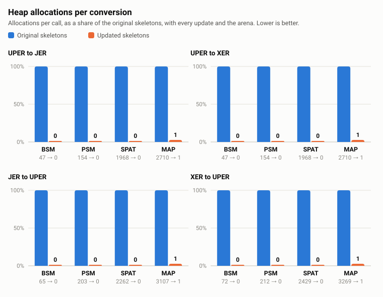

# Skeleton performance changes

Changes to the runtime skeletons (`skeletons/`) that make conversion between UPER and
XER/JER cheaper. The compiler and the generated code are not affected. The encoded output
is unchanged.

The changes fall into six groups, plus tests.

## 1. Integer formatting without `snprintf`

- **`asn_internal.c` / `.h`**: new `asn__format_imax` and `asn__format_umax`, which write
  decimal digits backwards into a small caller buffer.
- **`NativeInteger_xer.c`, `NativeInteger_jer.c`, `NativeInteger_print.c`**: use the
  formatter in place of `snprintf("%ld")`.
- **`INTEGER.c`** (`INTEGER__dump`): uses the formatter for plain numbers, and writes
  enumerated names directly instead of through `asn__format_to_callback` (a `vsnprintf`).
- **`NativeEnumerated_xer.c`, `NativeEnumerated_jer.c`**: write `<name/>` and `"name"` with
  `ASN__CALLBACK3` instead of `vsnprintf`.
- **`BIT_STRING_jer.c`**: the `"length"` value uses the formatter.

## 2. NativeInteger UPER without a temporary `INTEGER_t`

- **`NativeInteger_uper.c`**, decode: a constrained whole number is read straight into the
  `long`. Previously it went through a heap-allocated `INTEGER_t` (two malloc/free pairs
  per integer) and was converted back.
- **`NativeInteger_uper.c`**, encode: a value inside its constrained range is written
  directly, without building an `INTEGER_t` first.
- Unconstrained, semi-constrained and extension values still use the old path. The
  extension bit is read once and the fallback is told not to look for it again.

## 3. Fewer output callback calls

- **`asn_internal.c` / `.h`**: new `asn__callback3`, which joins up to three short pieces
  in a stack buffer and delivers them in one call. `ASN__CALLBACK2` and `ASN__CALLBACK3`
  now use it, so `<`, name, `>` is one call instead of three in every XER/JER encoder.
- **`asn_internal.c` / `.h`**: new `asn__text_indent`; `ASN__TEXT_INDENT` emits the newline
  and the whole indent in one call instead of one call per level.

An output callback now receives larger pieces than before. The bytes and their order are
the same.

## 4. Arena allocator (only with `-DASN_ARENA`)

- **`asn_internal.h`**: with the flag, `MALLOC`/`CALLOC`/`REALLOC`/`FREEMEM` point to
  arena-aware functions; without it they are `malloc`/`free` as before.
- **`asn_internal.c`**: the allocator itself. It is a per-thread bump allocator that starts
  in a caller-supplied buffer and spills to heap chunks. Freeing an arena pointer is a
  no-op, and heap pointers are still freed normally.
- **`asn_application.h`**: the public API (`asn_arena_t`, `asn_arena_init`,
  `asn_arena_use`, `asn_arena_reset`) with usage rules in the comment.
- **`asn_application.c`**: `asn_encode_to_new_buffer` calls `malloc`/`realloc`/`free`
  directly, so the buffer it returns is always heap memory the application can `free`.

Usage:

```c
char buffer[65536];
asn_arena_t arena;
asn_arena_init(&arena, buffer, sizeof(buffer));
asn_arena_use(&arena);
/* decode, check constraints, encode */
asn_arena_use(0);
asn_arena_reset(&arena);
```

Rules:

- A structure allocated from an arena dies with `asn_arena_reset()`. `ASN_STRUCT_FREE()` is
  not needed for it. Calling it is harmless while the same arena is still in use by the
  calling thread, and is an error after that.
- Memory allocated before `asn_arena_use()` is freed as usual.
- An arena is used by one thread at a time.

## 5. NativeInteger XER and JER decoding without a temporary `INTEGER_t`

- **`INTEGER_xer.c`, `INTEGER_jer.c`**: the text parsers are split from the conversion to
  `INTEGER_t` (`INTEGER__xer_body_parse`, `INTEGER__jer_body_parse`). New entry points
  `INTEGER__decode_xer_value` and `INTEGER__decode_jer_value` return a decimal number or an
  enumeration identifier as an `intmax_t`, with no allocation. `INTEGER_decode_xer` and
  `INTEGER_decode_jer` behave as before.
- **`INTEGER.h`**: declares the two entry points and their result type,
  `INTEGER__text_value_t`.
- **`NativeInteger_xer.c`, `NativeInteger_jer.c`**: decode through the new entry points and
  store the number directly. Previously each integer and each enumerated value cost two
  malloc/free pairs.
- The hexadecimal form of XER, and a negative number given for an unsigned type, still go
  through an `INTEGER_t`, so that they give the same result as before.

## 6. XML and JSON tokenizers skip over plain characters

- **`xer_support.c`** (`pxml_parse`), **`jer_support.c`** (`pjson_parse`): both went through
  their state machine once for every character of the input. Most characters change
  nothing in the state they are met in (the text between two tags, the letters of a tag
  or a key, the digits of a value), so each state now runs over those in a tight loop and
  enters the state machine only for a character that means something there.
- The tokens, the states and the handling of input that ends in the middle of a token are
  the same as before. The old and the new tokenizers were compared on the 13 messages and
  on random text, from every state, for every prefix and with callbacks that stop at
  different points: 37 million comparisons, no difference.
- Each tag is still tokenized twice, once by the type that contains it and once by the
  type it belongs to. That is the structure of the XER and JER decoders and is not
  changed here.

## Tests (`tests/tests-skeletons/`)

- **`check-INTEGER.c`**: compares the formatter with `snprintf` for edge values (0, ±1,
  `LONG_MIN`, `INTMAX_MIN`, and so on). For every existing XER and JER text case, it also
  checks that NativeInteger, signed and unsigned, accepts, refuses and yields the same as
  the INTEGER decoder.
- **`check-UPER-INTEGER.c`**: for every existing case, checks that NativeInteger produces
  the same bits as the INTEGER codec and reads them back. It covers in-range, extension,
  refused, unconstrained, semi-constrained and truncated input.
- **`check-arena.c`** (new): alignment, in-place and moving realloc, freeing the last
  block, overflow to the heap, oversized allocations, reset and reuse, and heap pointers
  mixed with arena pointers.
- **`check-tokenizers.c`** (new): the tokens of an XML and two JSON texts with attributes,
  comments, strings, escapes and nesting, and what the tokenizers consume and report for
  every prefix of them, against what the tokenizers gave before the change.
- **`Makefile.am`**: registers `check-arena`, `check-tokenizers` and their 32-bit variants.

## Measured effect

J2735 2024 `MessageFrame` messages (small BSM, PSM, SPAT, MAP), converted with
`convert_bytes` of `j2735-ffm-java`. CPU cycles per call (`perf stat`, user mode, clang 18
`-O3`, WSL2), relative to the skeletons before these changes:

| Direction | Without arena | With arena |
|---|---|---|
| UPER to JER | -32% to -38% | -45% to -53% |
| UPER to XER | -28% to -34% | -40% to -49% |
| JER to UPER | -25% to -27% | -32% to -35% |
| XER to UPER | -15% to -18% | -28% to -33% |

The chart shows each message before and after, one panel per direction: the original
skeletons at 100%, and the updated ones with everything above, the arena included. The
line under each message gives the cycles per call.



The charts are drawn by `make-charts.py`, which holds the numbers.

### Heap allocations

Each time the codec needs a piece of memory (for a decoded structure, a list item, a
string, a temporary buffer) it asks the system allocator for it with `malloc`, and gives it
back with `free` when the message is done. The count below is how many times that happens
during one `convert_bytes` call.

Fewer is better, for three reasons:

- **Time.** Every request and every release is work that has nothing to do with the
  message itself. In the original profile it was 11% of the call for a small BSM and 26%
  for a SPAT.
- **Threads.** The allocator is shared by all the threads of the process, so threads that
  allocate at the same time get in each other's way. A conversion that does not allocate
  cannot be slowed down by the others like that.
- **Predictability.** Thousands of small blocks requested and released in a different order
  each time leave the heap fragmented, and the time a request takes varies. With no
  requests, each conversion costs the same.

The updated skeletons make between a fifth and a half as many requests as the original
ones, mostly
because an integer no longer takes a temporary buffer on its way in or out. With the arena
the count drops to zero: the codec takes all its memory from one 64 kB block that
`convert_bytes` keeps on its stack, and drops it in one step at the end. The two largest
messages, MAP and TIM, need more than that block and take one extra 64 kB piece from the
heap, so they make one request where they used to make two to three thousand. A larger
block would bring them to zero as well.

Heap allocations in one `convert_bytes` call, original → updated → updated with arena:

| Message | UPER to JER or XER | JER to UPER | XER to UPER |
|---|---|---|---|
| Small BSM | 47 → 11 → 0 | 65 → 11 → 0 | 72 → 18 → 0 |
| PSM | 154 → 68 → 0 | 203 → 74 → 0 | 212 → 83 → 0 |
| SPAT | 1968 → 1084 → 0 | 2262 → 936 → 0 | 2429 → 1103 → 0 |
| MAP | 2710 → 1360 → 1 | 3107 → 1082 → 1 | 3269 → 1244 → 1 |

Of the 13 messages measured, 11 make no allocation at all with the arena, in every
direction. The chart shows the original skeletons against the final state, with every
update and the arena: the second bar of each pair is a sliver, drawn only so that it can
be seen, and the number above it is the count.



## Not done

- Each XML tag and JSON key is still tokenized twice (see group 6). Removing that means
  restructuring the XER and JER decoders.
- The arena has not been built for Windows/MinGW, and the 32-bit test variants were not
  run.
